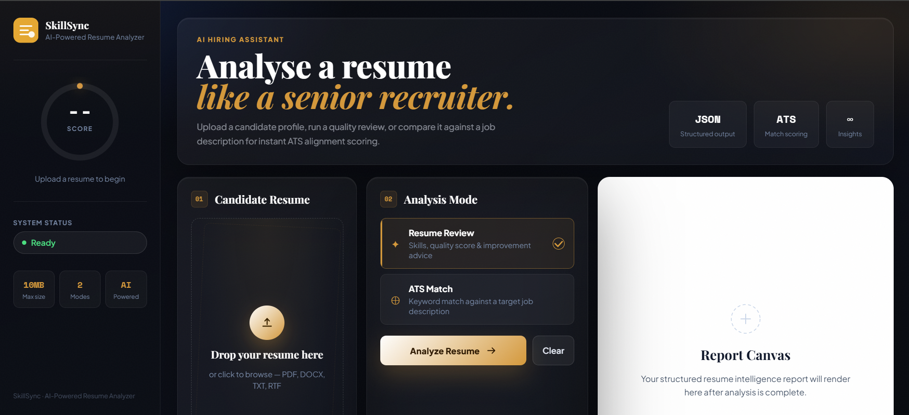
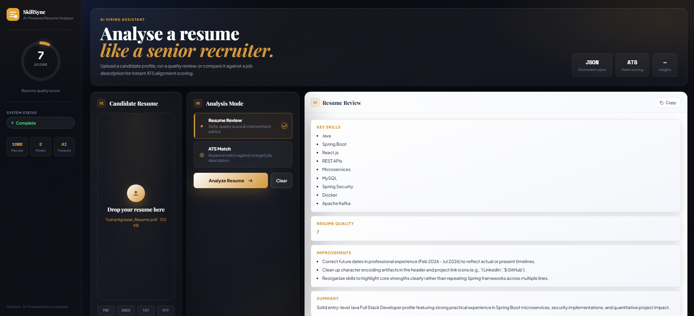
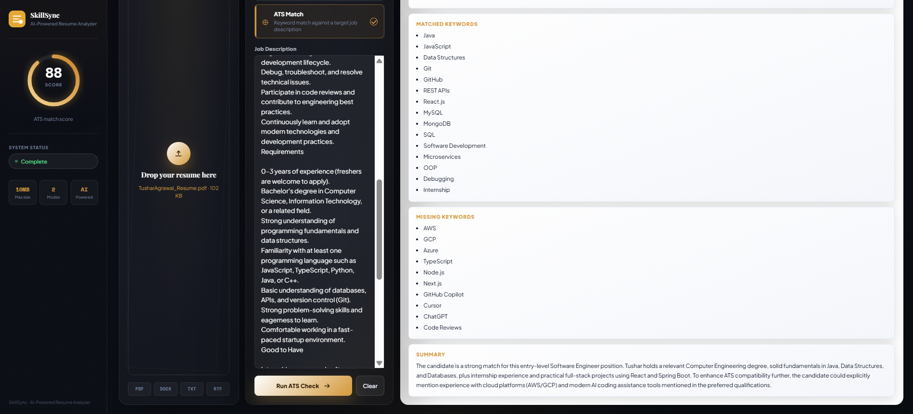

# SkillSync — AI-Powered Resume Analyzer

> **Analyze your resume. Measure your job fit. Improve with AI.**

SkillSync is a full-stack AI-powered resume analysis application that helps job seekers understand the quality of their resumes and evaluate how well they match a specific job description.

The application combines a **React + Vite frontend** with a **Java Spring Boot backend**, **Spring AI**, **Google Gemini**, and **Apache Tika**. Users can upload their resume, receive an AI-generated resume quality analysis, or compare their resume against a job description to identify matching and missing keywords.

The goal is to turn resume screening into a fast, structured, and actionable process instead of relying on manual keyword checking.

---

## ✨ Features

### 📄 AI Resume Analysis

* Upload a resume directly from the web interface.
* Extract resume content using **Apache Tika**.
* Analyze the resume using **Google Gemini through Spring AI**.
* Identify key technical and professional skills.
* Generate a resume quality score from **1–10**.
* Provide exactly three AI-generated improvement suggestions.
* Generate a concise resume summary.

### 🎯 ATS Job Matching

* Compare an uploaded resume against a job description.
* Generate an **ATS match score from 0–100**.
* Identify matched keywords.
* Identify missing keywords.
* Generate an AI-powered comparison summary.
* Help candidates identify skills and keywords they may need to emphasize.

### 🖥️ Modern Dashboard

* Responsive React-based interface.
* Drag-and-drop resume upload.
* Support for:

    * PDF
    * DOC
    * DOCX
    * TXT
    * RTF
* Dedicated resume analysis and ATS analysis modes.
* Dynamic score visualization.
* Real-time analysis status.
* Structured AI results display.
* Clear/reset workflow for running multiple analyses.

---

## 🏗️ Technical Architecture

SkillSync follows a simple **client-server architecture**.

```text
                    ┌─────────────────────────┐
                    │      React Frontend     │
                    │       Vite + React      │
                    │                         │
                    │ • Resume Upload         │
                    │ • ATS Mode              │
                    │ • Job Description       │
                    │ • Results Dashboard     │
                    └────────────┬────────────┘
                                 │
                           HTTP REST API
                                 │
                                 ▼
                    ┌─────────────────────────┐
                    │    Spring Boot Backend  │
                    │                         │
                    │   SkillSyncController   │
                    │                         │
                    │ • /analyze              │
                    │ • /ats-check            │
                    └────────────┬────────────┘
                                 │
                    ┌────────────┴────────────┐
                    │                         │
                    ▼                         ▼
          ┌─────────────────┐      ┌────────────────────┐
          │  Apache Tika    │      │     Spring AI      │
          │                 │      │                    │
          │ Resume Text     │      │ Google Gemini      │
          │ Extraction      │      │ AI Analysis        │
          └─────────────────┘      └────────────────────┘
```

### Request Flow

1. The user uploads a resume through the React frontend.
2. React sends the resume to the Spring Boot REST API using `multipart/form-data`.
3. Apache Tika extracts readable text from the uploaded document.
4. The backend constructs an AI analysis prompt.
5. Spring AI sends the prompt to Google Gemini.
6. Gemini returns structured JSON containing the analysis.
7. Spring Boot returns the result to the frontend.
8. React parses and displays the score, skills, recommendations, and analysis.

For ATS analysis, the job description is sent along with the resume and Gemini evaluates the relationship between the two.

---

## 🛠️ Tech Stack

| Layer               | Technology    |
| ------------------- | ------------- |
| Frontend            | React 18      |
| Frontend Tooling    | Vite          |
| Backend             | Java 21       |
| Backend Framework   | Spring Boot   |
| AI Integration      | Spring AI     |
| AI Model            | Google Gemini |
| Document Processing | Apache Tika   |
| API                 | REST          |
| Build Tool          | Maven         |
| Styling             | CSS           |
| Development Server  | Vite          |
| Backend Port        | `8080`        |
| Frontend Port       | `5173`        |

---

## 📁 Project Structure

```text
SkillSync/
│
├── SkillSync/
│   ├── src/
│   │   ├── main/
│   │   │   ├── java/
│   │   │   │   └── com/tushar/SkillSync/
│   │   │   │       ├── SkillSyncApplication.java
│   │   │   │       └── SkillSyncController.java
│   │   │   │
│   │   │   └── resources/
│   │   │       └── application.properties
│   │   │
│   │   └── test/
│   │
│   ├── pom.xml
│   ├── mvnw
│   └── mvnw.cmd
│
└── SkillSyncUI/
    ├── src/
    │   ├── components/
    │   │   ├── ControlCard/
    │   │   ├── Header/
    │   │   ├── ResultsPanel/
    │   │   ├── Sidebar/
    │   │   └── UploadCard/
    │   │
    │   ├── hooks/
    │   │   └── useAnalyzer.js
    │   │
    │   ├── utils/
    │   │   └── resumeUtils.js
    │   │
    │   ├── styles/
    │   │   └── global.css
    │   │
    │   ├── App.jsx
    │   └── main.jsx
    │
    ├── package.json
    ├── vite.config.js
    └── index.html
```

---

## 🚀 Getting Started

### Prerequisites

Make sure the following are installed:

* **Java 21**
* **Maven** or Maven Wrapper
* **Node.js 18+**
* **npm**
* A **Google Gemini API key**

Verify your installations:

```bash
java -version
mvn -version
node -v
npm -v
```

---

## 1. Clone the Repository

```bash
git clone https://github.com/TusharAgrawal-Dev/SkillSync.git
cd SkillSync
```


---

## 2. Configure the Gemini API Key

The backend expects the Gemini API key through an environment variable:

```text
GEMINI_API_KEY
```


### Windows PowerShell

```powershell
$env:GEMINI_API_KEY="your_api_key_here"
```

### Windows Command Prompt

```cmd
set GEMINI_API_KEY=your_api_key_here
```

### Linux/macOS

```bash
export GEMINI_API_KEY="your_api_key_here"
```

The backend configuration uses:

```properties
spring.ai.google.genai.api-key=${GEMINI_API_KEY}
```

---

## 3. Start the Spring Boot Backend

Open a terminal in:

```text
SkillSync/SkillSync
```

Run:

```bash
./mvnw spring-boot:run
```

On Windows:

```cmd
mvnw.cmd spring-boot:run
```

The backend starts on:

```text
http://localhost:8080
```

---

## 4. Start the React Frontend

Open a second terminal in:

```text
SkillSync/SkillSyncUI
```

Install dependencies:

```bash
npm install
```

Start the development server:

```bash
npm run dev
```

The frontend will be available at:

```text
http://localhost:5173
```

---

## 🧪 Usage

### Resume Analysis

1. Open the SkillSync frontend.
2. Upload your resume.
3. Select the resume analysis mode.
4. Click **Analyze**.
5. SkillSync extracts the resume text using Apache Tika.
6. Google Gemini analyzes the extracted content.
7. Review:

    * Resume quality score
    * Key skills
    * Improvement suggestions
    * AI-generated summary

### ATS Analysis

1. Upload your resume.
2. Switch to **ATS Check** mode.
3. Paste the target job description.
4. Click **Analyze**.
5. SkillSync compares the resume with the job description.
6. Review:

    * ATS score
    * Matched keywords
    * Missing keywords
    * AI-generated summary

---

## 🔌 API Endpoints

### Analyze Resume

```http
POST /api/resume/analyze
```

**Request:**

```text
multipart/form-data
file=<resume>
```

**Example Response:**

```json
{
  "analysis": {
    "keySkills": [
      "Java",
      "Spring Boot",
      "Microservices"
    ],
    "resumeQuality": 8,
    "improvements": [
      "Add measurable achievements",
      "Improve project descriptions",
      "Strengthen the summary section"
    ],
    "summary": "Strong backend development profile..."
  }
}
```

---

### ATS Check

```http
POST /api/resume/ats-check
```

**Request:**

```text
multipart/form-data
file=<resume>
jd=<job description>
```

**Example Response:**

```json
{
  "atsReport": {
    "atsScore": 82,
    "matchedKeywords": [
      "Java",
      "Spring Boot",
      "REST API"
    ],
    "missingKeywords": [
      "Docker",
      "Kubernetes"
    ],
    "summary": "The resume demonstrates strong alignment..."
  }
}
```

---

## 💡 Why I Built This

Many candidates submit resumes without knowing how effectively their experience and skills align with a particular job description.

At the same time, modern recruitment workflows often rely on automated screening systems to identify relevant skills and keywords before a recruiter reviews an application.

SkillSync was built to provide candidates with a practical way to evaluate their resumes before applying. By combining document processing with generative AI, the application converts an unstructured resume into actionable insights and highlights potential gaps between a candidate's profile and a target job.

The project also provided an opportunity to explore how **AI capabilities can be integrated into a real-world full-stack application using Java and Spring Boot**.

---

## 🧠 Challenges & Learnings


### Challenge 1 — Reliable Resume Text Extraction

Resumes can contain different layouts and document formats. A key challenge was extracting usable text from uploaded documents while keeping the processing simple for the AI layer.

**Learning:**
Integrating Apache Tika provided a flexible document parsing layer that allowed the backend to work with multiple document formats without implementing separate parsers for each format.

### Challenge 2 — Getting Consistent AI Responses

Generative AI responses can vary in structure. SkillSync addresses this by explicitly instructing the model to return structured JSON and by parsing the response on the frontend.

**Learning:**
Prompt design and response validation are important when integrating generative AI into applications that depend on predictable data structures.

### Challenge 3 — Connecting AI with a Full-Stack Application

The project required coordinating file uploads, REST APIs, document extraction, AI processing, and frontend state management.

**Learning:**
The project strengthened practical understanding of REST API design, multipart file handling, asynchronous frontend requests, AI integration, and error handling.

---

## 🗺️ Roadmap

Future improvements may include:

* [ ] Add resume section-level scoring for skills, experience, education, and formatting.
* [ ] Add downloadable AI-generated resume improvement reports.
* [ ] Support multiple job descriptions and resume comparison.
* [ ] Add user authentication and saved analysis history.
* [ ] Improve semantic matching beyond simple keyword identification.
* [ ] Add Docker-based deployment for the frontend and backend.
* [ ] Add automated tests for API endpoints and resume-processing workflows.

---

## 🔐 Security Notes

SkillSync requires a Gemini API key to communicate with the AI service.

**Never commit API keys or other secrets.**

Use environment variables:

```properties
spring.ai.google.genai.api-key=${GEMINI_API_KEY}
```

---

## 📸 Screenshots

Add screenshots of the application here to showcase the user interface.

### Dashboard


### Resume Analysis




### ATS Analysis



---

## 📌 Key Engineering Highlights

This project demonstrates practical experience with:

* **Java 21**
* **Spring Boot**
* **Spring AI**
* **Google Gemini API**
* **Apache Tika**
* **RESTful API development**
* **Multipart file uploads**
* **React**
* **Vite**
* **Asynchronous API communication**
* **AI prompt engineering**
* **Structured JSON processing**
* **Frontend state management**
* **Environment-based configuration**

---

## 👨‍💻 Author

### Tushar Agrawal

**Java Full-Stack Developer | Spring Boot & Microservices | Spring AI**

I am a Computer Engineering graduate focused on building backend and full-stack applications using Java, Spring Boot, Microservices, and AI technologies.

### Connect With Me

* **GitHub:** [TusharAgrawal-Dev](https://github.com/TusharAgrawal-Dev)
* **LinkedIn:** [Tushar_Agrawal](https://www.linkedin.com/in/tushar-agrawal-945347248/)

---

## 📄 License

This project is intended for educational and portfolio purposes.

Add a specific open-source license such as **MIT** if you intend to allow others to use, modify, and distribute the project under those terms.

---

<p align="center">
  Built with Java, Spring Boot, React, Spring AI & Google Gemini
</p>
